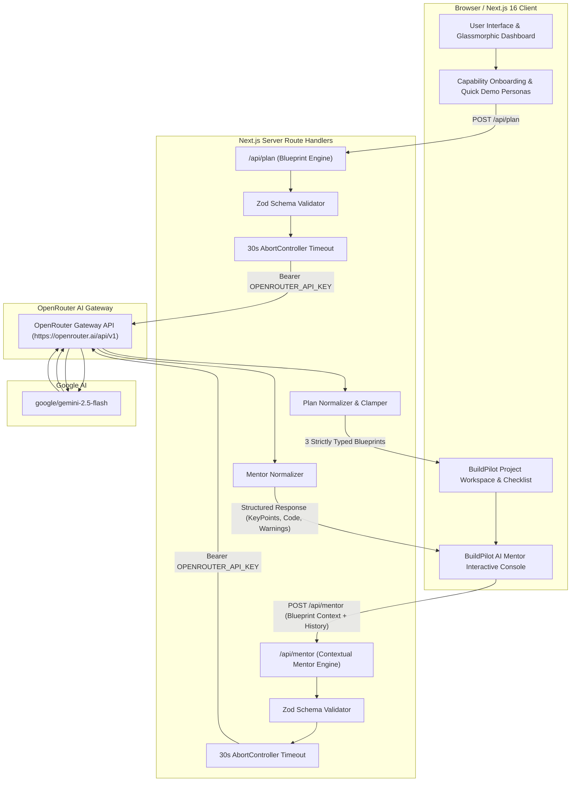

# BuildPilot — System Architecture & Technical Specification
### AI-Powered Project Intelligence • Build Better. Defend Smarter.

---

## 1. High-Level Architecture Overview

BuildPilot is built on a fullstack Next.js architecture (App Router) designed for high reliability, strict schema validation, server-side credential isolation, and resilient LLM response normalization.

---

## 2. Recommendation Engine Pipeline (`/api/plan`)

### Flow:
1. **Client Submission:** The student submits skills, interests, experience level, team size, duration, budget, and domain.
2. **Payload Parsing & Validation:** The route handler parses the JSON body and validates it against `profileSchema` using Zod. Any malformed or out-of-range values trigger an immediate `400 Bad Request`.
3. **Prompt Synthesis:** A specialized system instruction acts as BuildPilot (Senior Software Architect & Academic Project Advisor), enforcing:
   - Practical, defendable capstone projects matching the student's background.
   - Budget constraints (e.g., free-tier/open-source tools for budgets under ₹5,000).
   - Strict JSON output without markdown backticks.
4. **Resilient OpenRouter Execution:**
   - Model: `google/gemini-2.5-flash`
   - `response_format: { type: 'json_object' }`
   - 30-second `AbortController` timeout to prevent hanging connections.
5. **Response Extraction & Normalization:**
   - Safely handles text strings or content part arrays (`choices[0].message.content`).
   - Strips code fences and surrounding prose using substring boundary detection.
   - Normalizes and bounds numeric scores (0–100 for `skillMatch`, `feasibility`, `innovation`, `overallScore`).
   - Fills missing fields with structured fallbacks to guarantee exact conformance with `PlanApiResponse`.
6. **Return Payload:** Exactly 3 fully hydrated, defendable project blueprints with 5-tier architecture, roadmaps, and viva questions.

---

## 3. Context-Aware AI Mentor Pipeline (`/api/mentor`)

### Flow:
1. **Context-Rich Request:** The client sends:
   - `project`: Selected project's title, problem, solution, features, 5-tier tech stack, roadmap, risks, and future scope.
   - `studentProfile`: Technical skills, interests, experience level, team size, duration, and budget.
   - `conversation`: Sliding window of up to 20 previous user and assistant messages for memory continuity.
   - `question`: Current question from user (or 1-click quick action prompt).
2. **Zod Validation:** Validates payload against `mentorRequestSchema`, enforcing character limits to prevent prompt injection and token overflow.
3. **System Prompt Formulation:** Injects the active project blueprint into the system prompt so the model acts as a dedicated technical advisor for that specific project stack.
4. **OpenRouter Inference:** Dispatches request to `google/gemini-2.5-flash` with a 30s timeout.
5. **Response Normalization:** Parses output into `MentorApiResponse`:
   - `answer`: Clear, direct explanation.
   - `keyPoints`: 3-4 structured architectural/conceptual takeaways.
   - `nextSteps`: 2-3 concrete implementation tasks.
   - `code`: Optional clean, copyable code snippet.
   - `warnings`: Scope, security, or timeline risk advisories.
6. **Client Render:** Rendered in real-time with 1-click code copying and JSON chat history export.

---

## 4. Key Security & Resilience Controls

| Security / Reliability Layer | Implementation Detail |
| :--- | :--- |
| **Server-Side Key Isolation** | `OPENROUTER_API_KEY` is loaded strictly on the server via `process.env`. Zero exposure to client bundle. |
| **Git Protection** | `.gitignore` ignores all `.env*` files while allowing `.env.example`. |
| **Input Boundary Validation** | Zod schemas enforce type constraints, array length maximums, and string length caps. |
| **Timeout Protection** | Both API routes implement 30-second `AbortController` timeouts with `504 Gateway Timeout` handling. |
| **JSON Sanitization** | Multi-strategy regex-based markdown fence removal and substring extraction prevent formatting errors. |
| **Graceful Error Recovery** | Sanitized error responses prevent stack trace leaks while offering actionable feedback to the user. |
| **State Preservation** | Client-side errors never erase user inputs, selected workspace state, or active chat history. |
